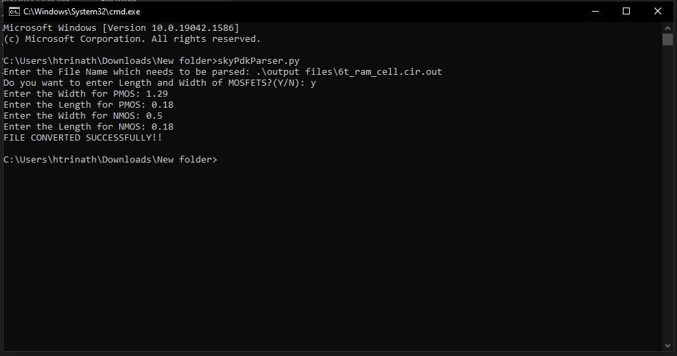

# SkyWater 130PDK Parser:
This repository contains the code for a Python program which converts the generated NgSpice netlist to be compatible with SkyWater 130 PDK

# Pre-Requisites to run this code:
1. You will need to have Python3 installed in your local.
2. You will need an NgSpice netlist which will be used as an input to this program.

# Procedure to use the Python File:
1. Clone this repository in your local.
2. Open the Command Prompt in the directory where the code is present and enter the name of the python file.

   
  Fig. 1: Enter the Name of the Python file:

3. After pressing 'Enter' the cmd will prompt you to input the name of the NgSpice Netlist(if present in the same directory else enter location of the file) which you want to parse.
 

   
  Fig. 2: Enter the Name/Location of the Netlist:

4. After pressing 'Enter' assuming that the entered file is present the cmd will prompt you asking if you want to manually enter the Lengths and Widths of NMOS and PMOS.
5. If you input Y or y  you will be prompted to enter the PMOS Width, Length and then NMOS Width, Length.
 

   
  Fig. 3: Enter the Widths and Lengths of MOSFETS:

6. If you do not wish to enter the Widths and Lengths for MOSFETS you can input n or N which will assign generic values for PMOS and NMOS as PMOS(w=1.29 l=0.18), NMOS(w=0.5 l=0.18)
7. On giving the inputs the Program will run successfully giving a message on the screen as "FILE CONVERTED SUCCESSFULLY!!"

   
  Fig. 4: File Conversion Successful:

# Error Handling features in the code:
1. If the file name entered is not present at the location then the program will exit giving a message as "FILE NOT FOUND!!"

   
  Fig. 5: File Not Found:

2. If the file is present and you enter a wrong input when the cmd asks if you want to enter the PMOS and NMOS widths and lengths then the code exits giving a message as "Invalid input entered!!" 

   
  Fig. 6: Invalid Input:

# Input Files to test the code:
1. 6T RAM Cell: <a href='6t_ram_cell.cir.out'>Here</a> 
2. Full Adder Circuit taken from eSIM completed circuits: <a href='full_adder.cir.out'>Here</a> 

# Output Files obtained:
1. 6T RAM Cell: <a href='output files/6t_ram_cell.cir.out'>Here</a> 
2. Full Adder Circuit: <a href='output files/full_adder.cir.out'>Here</a> 

# Author:
• Trinath Harikrishna, B.Tech(ECE), SRM Institute of Science and Technology, Kattankulattur, Chennai-603203.
